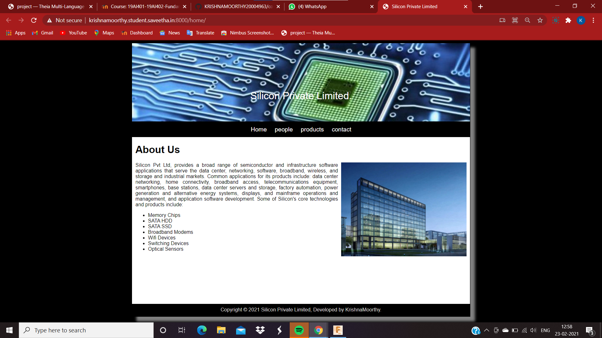
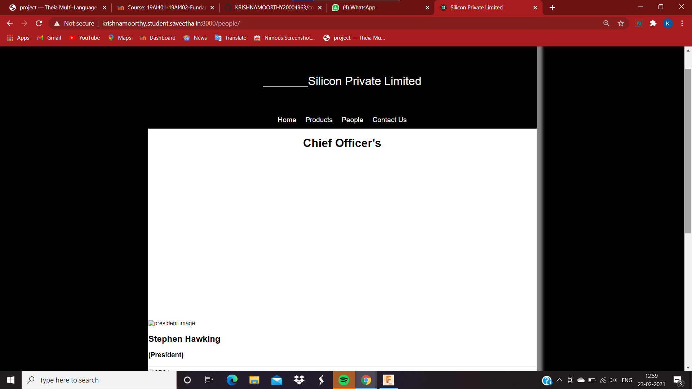
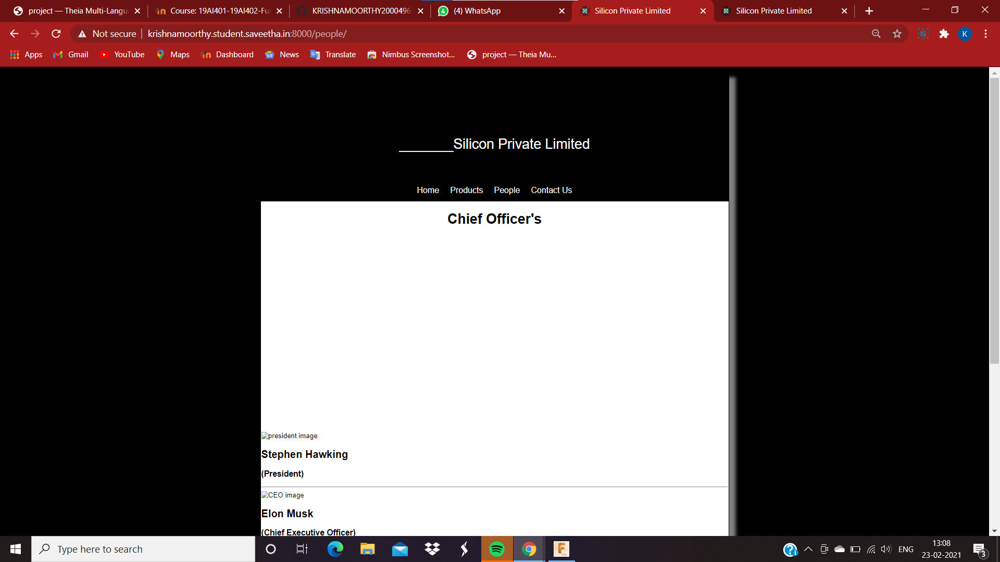
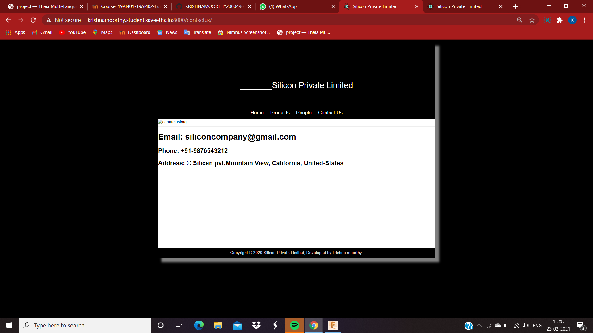
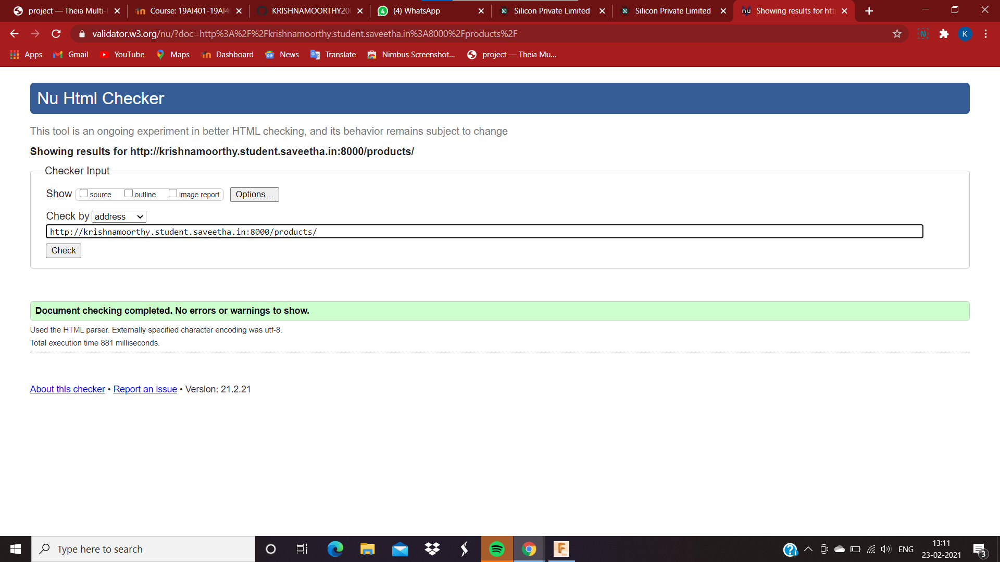

# Web Design for a Manufacturing Company
## AIM: 
To design a static website for a chip manufacturing company.

## DESIGN STEPS:
### Step 1: 
Requirement collection.
### Step 2:
Creating the layout using HTML and CSS.
### Step 3:
Updating the sample content.
### Step 4:
Choose the appropriate style and color scheme.
### Step 5:
Validate the layout in various browsers.
### Step 6:
Validate the HTML code.
### Step 6:
Publish the website in the given URL.

## PROGRAM:

### base.html
```

<!DOCTYPE html>
<html lang="en">

<head>
    <title>Silicon Private Limited</title>
    <link rel="stylesheet" href="">
    <link rel = "icon" href ="" type = "image/x-icon"> 
              
</head>

<body>
    <div class="container">
    <div class="banner">
        Silicon Private Limited.
    </div>
    <div class="menu">
        <div class="menuitem"><a href="/home">Home</a></div> 
        <div class="menuitem"><a href="/products">Products</a></div> 
        <div class="menuitem"><a>People</a></div>
        <div class="menuitem"><a>Contact Us</a></div> 
    </div><div class="content">
        
    
    </div>
    <div class="footer">
        Copyright © 2020 Silicon Private Limited, Developed by Obed Otto.
    </div>
    </div>
</body>

</html>
```

### home.html
```



    <div class="homecontent">    
    <h1>About Us</h1>
    
    <div class="contenttext">
    Silicon Pvt Ltd, provides a broad range of semiconductor and infrastructure software applications. Some of Silicon's core technologies and products include:
    <ul>
        <li>Memory Chips</li>
        <li>SATA HDD</li>
        <li>SATA SSD </li>
        <li>Broadband Modems</li>
        <li>Wifi Devices</li>
        <li>Switching Devices</li>
        <li>Optical Sensors</li>
    </ul> 
    </div>
    </div>

```
### products.html
```



    <div class="productcontent">    
    <h1>Our Premium Products</h1>
    <div class="productitems">
        <div class="productitem"> 
            <div class="itemimage">
            
            </div>
            <div class="itemname">4GB DDRA4 laptop memory</div>
            <div class="itemprice">Price: Rs.2000.00 </div>
        </div>
        <div class="productitem"> 
            <div class="itemimage">
            
            </div>
            <div class="itemname">1TB Laptop HDD</div>
            <div class="itemprice">Price: Rs.5000.00 </div>
        </div>
    </div>
    </div>

```

### people.html

```




    <div class="peoplecontent">
        <h1>Chief Officer's</h1>
    </div>
    <div class="peoplelists">
        <div class="peoplelist">
            <div class="peopleimage">
                
            </div>
            <div class="peoplename"><h2>Stephen Hawking</h2></div>
            <div class="peoplepost"><h3>(President)</h3></div>
        </div>
    </div>
    <div>
        <hr>
    </div>
    <div class="peoplelists">
        <div class="peoplelist">
            <div class="peopleimage">
                
            </div>
            <div class="peoplename"><h2>Elon Musk</h2></div>
            <div class="peoplepost"><h3>(Chief Executive Officer)</h3></div>
        </div>
    </div>
    <div>
        <hr>
    </div>
    <div class="peoplelists">
        <div class="peoplelist">
            <div class="peopleimage">
                
            </div>
            <div class="peoplename"><h2>Steve Jobs</h2></div>
            <div class="peoplepost"><h3>(Chief Operating Officer)</h3></div>
        </div>
    </div>
    <div>
        <hr>
    </div>
    <div class="peoplelists">
        <div class="peoplelist">
            <div class="peopleimage">
                
            </div>
            <div class="peoplename"><h2>Bill Gates</h2></div>
            <div class="peoplepost"><h3>(Chief Financial Officer)</h3></div>
        </div>
    </div>
    <div>
        <hr>
    </div>
    <div class="peoplelists">
        <div class="peoplelist">
            <div class="peopleimage">
                
            </div>
            <div class="peoplename"><h2>Sundar Pichai</h2></div>
            <div class="peoplepost"><h3>(Chief Legal Officer)</h3></div>
        </div>
    </div>
    <div>
        <hr>
    </div>
    <div class="peoplelists">
        <div class="peoplelist">
            <div class="peopleimage">
                
            </div>
            <div class="peoplename"><h2>Jeff Bezoz</h2></div>
            <div class="peoplepost"><h3>(Chief Marketing Officer)</h3></div>
        </div>
    </div>


```
### contactus.html
```



    <div class="contactuscontent">
        <div class="contactbox">
            <div>
                
            </div>
        </div>
        <hr/>
        <div class="contactemail"><h1>Email: siliconcompany@gmail.com</h1></div>
        <div class="contactphone"><h2>Phone: +91-9876543212</h2></div>
        <div class="contactphone"><h2>Address: © Silican pvt,Mountain View, California, United-States</h2></div>
        <hr/>
    </div>


```
## OUTPUT:







## CODE VALIDATION REPORT:





## RESULT:
Thus a website is designed for the chip manufacturing company and is hosted in the URL http://krishnamoorthy.student.saveetha.in:8000/home/. HTML code is validated.